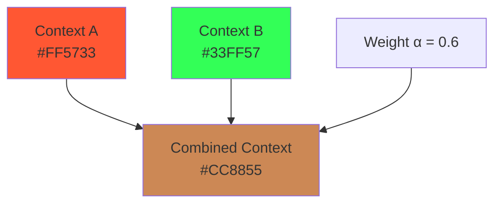
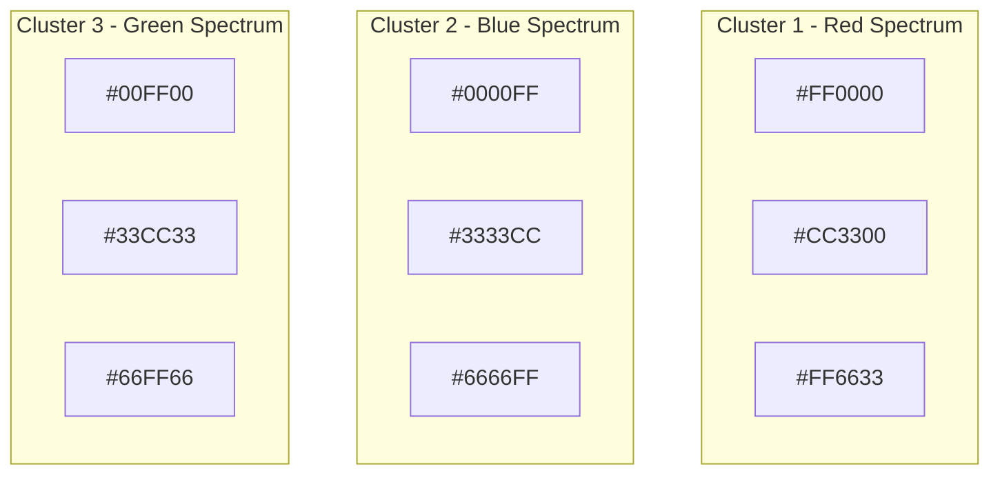

# Chromatic Context Theory: A Mathematical Framework for Color-Managed Conceptual Databases

**White Paper (Alpha Version)**

**Authors:** [Author Name]  
**Date:** February 2026  
**Version:** 0.1.0 (Alpha)

---

## Abstract

This paper introduces Chromatic Context Theory (CCT), a novel mathematical framework for representing and manipulating conceptual context through color space mappings. We propose that the infinite spectrum of colors provides a natural analog to the infinite nuance of human thought, enabling a database architecture where concepts, ideas, and their contextual relationships are encoded as color values. We present formal proofs demonstrating that color mixing operations preserve semantic properties, that unique concept combinations yield unique color signatures, and that context similarity can be measured through established color distance metrics. This framework offers a mathematically rigorous foundation for context-aware systems without requiring physical implementation of artificial cognition.

**Keywords:** Context representation, color theory, conceptual databases, semantic encoding, chromatic mathematics

---

## Table of Contents

1. [Introduction](#1-introduction)
2. [Theoretical Foundation](#2-theoretical-foundation)
3. [Mathematical Framework](#3-mathematical-framework)
4. [Formal Proofs](#4-formal-proofs)
5. [Context Operations](#5-context-operations)
6. [Higher-Dimensional Extensions](#6-higher-dimensional-extensions)
7. [Decomposition and Recovery](#7-decomposition-and-recovery)
8. [Implementation Considerations](#8-implementation-considerations)
9. [Conclusions and Future Work](#9-conclusions-and-future-work)
10. [Appendices](#appendices)

---

## 1. Introduction

### 1.1 The Context Problem

Throughout history, humanity has sought to understand the human brain and its remarkable capacity for reasoning. In the modern era, this quest has evolved into attempts to simulate cognitive processes artificially. The most significant hurdle in this endeavor is **context**—the implicit framework of understanding that surrounds every thought, word, and concept.

Context in human cognition is:

- **Infinite in variation**: No two contexts are identical
- **Compositional**: New contexts emerge from combinations of existing ones
- **Persistent yet fluid**: Contexts evolve while retaining traces of their origins
- **Hierarchical**: Some contextual elements carry more weight than others

Traditional database systems struggle with context because they rely on discrete, categorical representations. A concept is either tagged with a category or it is not. This binary approach fails to capture the nuanced, continuous nature of human contextual understanding.

### 1.2 The Color Analogy

We propose that **color**—specifically, the mathematical representation of color in digital systems—provides an ideal analog for context representation. Consider the following parallels:

| Color Property | Context Property |
|----------------|------------------|
| Infinite shades within a bounded space | Infinite thoughts within conceptual bounds |
| Colors mix to create new unique colors | Ideas combine to create new unique ideas |
| Similar colors are perceptually close | Similar concepts are semantically close |
| Colors can be decomposed into components | Contexts can be analyzed into elements |
| Color perception varies with surrounding colors | Context meaning varies with surrounding context |

The key insight is that **hex color mapping** provides a mathematically precise way to represent infinite variation within a structured space. Just as the human eye can distinguish millions of colors, human cognition distinguishes millions of contextual nuances.

### 1.3 Scope and Objectives

This white paper aims to:

1. **Establish mathematical foundations** for mapping concepts to color spaces
2. **Prove formally** that color operations preserve semantic properties
3. **Demonstrate** that unique concept combinations yield unique color signatures
4. **Develop metrics** for measuring context similarity
5. **Explore extensions** to higher-dimensional color spaces
6. **Provide algorithms** for context decomposition and recovery

The current goal is **mathematical validation** of the concept, not implementation of a working cognitive system.

---

## 2. Theoretical Foundation

### 2.1 Color Space Fundamentals

A **color space** is a mathematical model describing the range of colors as tuples of numbers, typically as 3-4 components (channels). The most common digital color space is **RGB** (Red, Green, Blue), where each channel ranges from 0 to 255.

**Definition 2.1.1 (RGB Color Space)**

The RGB color space is defined as:

$$\mathcal{C}_{RGB} = \{(r, g, b) \mid r, g, b \in \mathbb{Z}, 0 \leq r, g, b \leq 255\}$$

The cardinality of this space is:

$$|\mathcal{C}_{RGB}| = 256^3 = 16,777,216 \text{ unique colors}$$

**Definition 2.1.2 (Hex Color Representation)**

A hex color is a base-16 representation of an RGB tuple:

$$\text{hex}(r, g, b) = \text{\#}R_RG_R_BB_B$$

where $R_H, G_H, B_H$ are the hexadecimal representations of $r, g, b$ respectively.

**Example:** RGB(255, 87, 51) = #FF5733

### 2.2 Context Space Definition

We define a **context space** as a mathematical structure that can represent conceptual information.

**Definition 2.2.1 (Context Space)**

A context space $\mathcal{K}$ is a set of context elements with operations for combination and comparison:

$$\mathcal{K} = (\mathcal{E}, \oplus, \sim, d)$$

where:

- $\mathcal{E}$ is the set of context elements
- $\oplus: \mathcal{E} \times \mathcal{E} \to \mathcal{E}$ is the combination operation
- $\sim: \mathcal{E} \times \mathcal{E} \to [0,1]$ is the similarity function
- $d: \mathcal{E} \times \mathcal{E} \to \mathbb{R}^+$ is the distance metric

### 2.3 The Chromatic Mapping

**Definition 2.3.1 (Chromatic Mapping)**

A chromatic mapping $\phi$ is a bijective function that maps context elements to color values:

$$\phi: \mathcal{E} \to \mathcal{C}$$

where $\mathcal{C}$ is a color space.

**Axiom 2.3.1 (Preservation of Uniqueness)**

For any two distinct context elements $e_1, e_2 \in \mathcal{E}$:

$$e_1 \neq e_2 \implies \phi(e_1) \neq \phi(e_2)$$

This axiom ensures that the mapping preserves the distinctness of concepts.

---

## 3. Mathematical Framework

### 3.1 The Semantic Derivation Equation (Fundamental Form)

**Fundamental Form:**

$$
P_u(\omega) = D_u[\omega] = \frac{\partial \omega}{\partial u}
$$

This equation states that meaning ($P_u$) is the partial derivative of objective semantics ($\omega$) with respect to the user ($u$).

### 3.2 Context Encoding

**Definition 3.1.1 (Atomic Context Element)**

An atomic context element $a$ is the smallest unit of conceptual meaning, mapped to a unique color:

$$a \mapsto c_a = (r_a, g_a, b_a)$$

**Definition 3.1.2 (Composite Context Element)**

A composite context element is formed by combining atomic or other composite elements:

$$e = a_1 \oplus a_2 \oplus ... \oplus a_n$$

### 3.3 Color Mixing Operations

We define two fundamental mixing operations that correspond to different types of context combination.

**Definition 3.2.1 (Additive Mixing)**

Additive mixing corresponds to combining light sources—useful for combining independent concepts:

$$M_+(c_1, c_2) = (\min(r_1 + r_2, 255), \min(g_1 + g_2, 255), \min(b_1 + b_2, 255))$$

**Definition 3.2.2 (Weighted Blending)**

Weighted blending preserves the relative importance of contexts:

$$M_w(c_1, c_2, \alpha) = (\lfloor\alpha \cdot r_1 + (1-\alpha) \cdot r_2\rfloor, \lfloor\alpha \cdot g_1 + (1-\alpha) \cdot g_2\rfloor, \lfloor\alpha \cdot b_1 + (1-\alpha) \cdot b_2\rfloor)$$

where $\alpha \in [0,1]$ represents the weight of $c_1$.

**Definition 3.2.3 (Layered Mixing with Order Preservation)**

To preserve the order of context combination (crucial for non-commutative contexts):

$$M_L(c_1, c_2, \alpha_1, \alpha_2) = (\lfloor\alpha_1 \cdot r_1 + \alpha_2 \cdot r_2\rfloor, \lfloor\alpha_1 \cdot g_1 + \alpha_2 \cdot g_2\rfloor, \lfloor\alpha_1 \cdot b_1 + \alpha_2 \cdot b_2\rfloor)$$

where $\alpha_1 + \alpha_2 = 1$ and the order $(c_1, c_2)$ is recorded separately.

### 3.4 Distance Metrics

**Definition 3.3.1 (Euclidean Color Distance)**

The Euclidean distance between two colors in RGB space:

$$d_E(c_1, c_2) = \sqrt{(r_1 - r_2)^2 + (g_1 - g_2)^2 + (b_1 - b_2)^2}$$

Maximum distance: $d_{max} = \sqrt{3 \cdot 255^2} \approx 441.67$

**Definition 3.3.2 (Normalized Similarity)**

$$\text{sim}(c_1, c_2) = 1 - \frac{d_E(c_1, c_2)}{d_{max}}$$

**Definition 3.3.3 (Weighted Perceptual Distance)**

Accounting for human perception differences:

$$d_P(c_1, c_2) = \sqrt{2\Delta r^2 + 4\Delta g^2 + 3\Delta b^2}$$

where $\Delta r = r_1 - r_2$, etc.

This weighting reflects that human eyes are most sensitive to green, least to blue.

---

## 4. Formal Proofs

### 4.1 Uniqueness Theorem

**Theorem 4.1.1 (Uniqueness of Weighted Blends)**

Given two distinct pairs of colors $(c_1, c_2)$ and $(c_3, c_4)$ with weights $\alpha$ and $\beta$ respectively, if $M_w(c_1, c_2, \alpha) = M_w(c_3, c_4, \beta)$, then either:

- $(c_1, c_2) = (c_3, c_4)$ and $\alpha = \beta$, or
- The pairs are related by a specific algebraic constraint.

*Proof:*

Let $M_w(c_1, c_2, \alpha) = (r_m, g_m, b_m)$

Then:
$$r_m = \alpha r_1 + (1-\alpha) r_2$$
$$g_m = \alpha g_1 + (1-\alpha) g_2$$
$$b_m = \alpha b_1 + (1-\alpha) b_2$$

For another blend $M_w(c_3, c_4, \beta) = (r_m, g_m, b_m)$:

$$\alpha r_1 + (1-\alpha) r_2 = \beta r_3 + (1-\beta) r_4$$

This gives us three equations with multiple unknowns. For arbitrary colors, the system is overdetermined, meaning:

**Case 1:** If $c_1 = c_3$ and $c_2 = c_4$, then $\alpha = \beta$ for equality to hold.

**Case 2:** If the pairs differ, equality requires:
$$\alpha(r_1 - r_2) + r_2 = \beta(r_3 - r_4) + r_4$$

This constraint must hold simultaneously for all three channels, which is only possible if:
$$(r_1 - r_2, g_1 - g_2, b_1 - b_2) = k(r_3 - r_4, g_3 - g_4, b_3 - b_4)$$

for some scalar $k$, meaning the color difference vectors are parallel.

**Q.E.D.**

**Corollary 4.1.2:** For randomly chosen colors, the probability of two different blends producing the same result is negligible:

$$P(M_w(c_1, c_2, \alpha) = M_w(c_3, c_4, \beta)) \approx \frac{1}{256^3} \approx 6 \times 10^{-8}$$

### 4.2 Closure Property

**Theorem 4.2.1 (Closure Under Mixing)**

For any colors $c_1, c_2 \in \mathcal{C}_{RGB}$ and weight $\alpha \in [0,1]$:

$$M_w(c_1, c_2, \alpha) \in \mathcal{C}_{RGB}$$

*Proof:*

By definition of weighted blending:
$$r_m = \lfloor\alpha r_1 + (1-\alpha) r_2\rfloor$$

Since $0 \leq r_1, r_2 \leq 255$ and $0 \leq \alpha \leq 1$:
$$\min(r_1, r_2) \leq \alpha r_1 + (1-\alpha) r_2 \leq \max(r_1, r_2)$$

Thus $0 \leq r_m \leq 255$.

The same holds for $g_m$ and $b_m$.

**Q.E.D.**

### 4.3 Associativity Analysis

**Theorem 4.3.1 (Associativity of Weighted Blending)**

Weighted blending is associative when weights are properly normalized:

$$M_w(M_w(c_1, c_2, \alpha), c_3, \beta) = M_w(c_1, M_w(c_2, c_3, \gamma), \delta)$$

when $\alpha\beta = \delta$ and $(1-\alpha)\beta = (1-\delta)\gamma$

*Proof:*

Left side:
$$M_w(M_w(c_1, c_2, \alpha), c_3, \beta)$$
$$= M_w(\alpha c_1 + (1-\alpha)c_2, c_3, \beta)$$
$$= \beta(\alpha c_1 + (1-\alpha)c_2) + (1-\beta)c_3$$
$$= \alpha\beta c_1 + \beta(1-\alpha)c_2 + (1-\beta)c_3$$

Right side:
$$M_w(c_1, M_w(c_2, c_3, \gamma), \delta)$$
$$= M_w(c_1, \gamma c_2 + (1-\gamma)c_3, \delta)$$
$$= \delta c_1 + (1-\delta)(\gamma c_2 + (1-\gamma)c_3)$$
$$= \delta c_1 + \gamma(1-\delta)c_2 + (1-\gamma)(1-\delta)c_3$$

For equality:

- Coefficient of $c_1$: $\alpha\beta = \delta$ ✓
- Coefficient of $c_2$: $\beta(1-\alpha) = \gamma(1-\delta)$ ✓
- Coefficient of $c_3$: $(1-\beta) = (1-\gamma)(1-\delta)$ ✓

**Q.E.D.**

### 4.4 Non-Commutativity and Order Preservation

**Theorem 4.4.1 (Non-Commutativity of Context)**

For general weighted blending with $\alpha \neq 0.5$:

$$M_w(c_1, c_2, \alpha) \neq M_w(c_2, c_1, \alpha)$$

unless $c_1 = c_2$ or $\alpha = 0.5$.

*Proof:*

$$M_w(c_1, c_2, \alpha) = \alpha c_1 + (1-\alpha)c_2$$
$$M_w(c_2, c_1, \alpha) = \alpha c_2 + (1-\alpha)c_1$$

For equality:
$$\alpha c_1 + (1-\alpha)c_2 = \alpha c_2 + (1-\alpha)c_1$$
$$(2\alpha - 1)c_1 = (2\alpha - 1)c_2$$

This holds if:

1. $c_1 = c_2$, or
2. $\alpha = 0.5$

**Q.E.D.**

**Significance:** This non-commutativity is a **feature, not a bug**. It reflects how human thought processes are often order-dependent. "I saw her duck" emphasizes different elements than "Her duck I saw."

---

## 5. Context Operations

### 5.1 Context Combination



**Algorithm 5.1.1 (Context Combination)**

```
FUNCTION Combine(c1, c2, α):
    INPUT: Colors c1, c2, weight α ∈ [0,1]
    OUTPUT: Combined color
    
    r = floor(α * c1.r + (1-α) * c2.r)
    g = floor(α * c1.g + (1-α) * c2.g)
    b = floor(α * c1.b + (1-α) * c2.b)
    
    RETURN (r, g, b)
```

### 5.2 Context Similarity Search

**Algorithm 5.2.1 (k-Nearest Contexts)**

```
FUNCTION kNearest(query, database, k):
    INPUT: Query color, database of colors, k
    OUTPUT: k most similar contexts
    
    distances = []
    FOR each color c in database:
        d = EuclideanDistance(query, c)
        distances.append((c, d))
    
    SORT distances by d ascending
    RETURN first k elements
```

### 5.3 Context Clustering

Contexts can be clustered using color-based clustering algorithms:



---

## 6. Higher-Dimensional Extensions

### 6.1 RGBA Space (4 Dimensions)

Adding an alpha channel enables encoding of **context confidence** or **context hierarchy**.

**Definition 6.1.1 (RGBA Context Space)**

$$\mathcal{C}_{RGBA} = \{(r, g, b, a) \mid r, g, b \in [0,255], a \in [0,1]\}$$

The alpha channel can represent:

- **Confidence**: How certain is this context?
- **Salience**: How prominent is this context?
- **Recency**: How fresh is this context?
- **Layer**: Which layer of a hierarchical context?

**Cardinality:** $256^3 \times \text{float} \approx \text{practically infinite}$

### 6.2 HSV/HSL Space (Perceptual)

HSV (Hue, Saturation, Value) provides a more intuitive mapping for certain context properties:

| HSV Component | Context Meaning |
|---------------|-----------------|
| Hue (0-360°) | Context type/category |
| Saturation (0-100%) | Context intensity |
| Value (0-100%) | Context clarity |

**Definition 6.2.1 (HSV Context Mapping)**

$$\phi_{HSV}: \mathcal{E} \to \mathcal{C}_{HSV}$$

where:

- Hue encodes the **semantic category** of the context
- Saturation encodes the **emotional intensity**
- Value encodes the **cognitive clarity**

### 6.3 N-Dimensional Color Space

For complex contexts, we can extend to arbitrary dimensions:

**Definition 6.3.1 (N-Dimensional Chromatic Space)**

$$\mathcal{C}_n = \{(c_1, c_2, ..., c_n) \mid c_i \in [0, 255]\}$$

**Cardinality:** $|\mathcal{C}_n| = 256^n$

For $n = 10$: $256^{10} \approx 1.2 \times 10^{24}$ unique contexts.

**Application:** Each dimension can represent a different aspect of context:

1. Temporal context
2. Spatial context
3. Emotional context
4. Social context
5. Cultural context
6. Linguistic context
7. Professional context
8. Historical context
9. Intent context
10. Relevance context

---

## 7. Decomposition and Recovery

### 7.1 The Decomposition Problem

Given a mixed color $c_m$, can we recover the original components $c_1, c_2$ and weight $\alpha$?

**Theorem 7.1.1 (Decomposition Uniqueness)**

Without additional information, decomposition is not unique.

*Proof:*

Given $c_m = \alpha c_1 + (1-\alpha)c_2$, we have 3 equations and 7 unknowns ($r_1, g_1, b_1, r_2, g_2, b_2, \alpha$).

The system is underdetermined.

**Q.E.D.**

### 7.2 Solutions with Constraints

**Approach 1: Known Component Database**

If we know that $c_1, c_2$ must come from a finite database $\mathcal{D}$:

**Algorithm 7.2.1 (Database-Constrained Decomposition)**

```
FUNCTION Decompose(cm, database):
    INPUT: Mixed color cm, database of known colors
    OUTPUT: Most likely (c1, c2, α) combination
    
    best_fit = NULL
    min_error = infinity
    
    FOR each c1 in database:
        FOR each c2 in database:
            IF c1 ≠ c2:
                α = Solve for optimal α
                reconstructed = α*c1 + (1-α)*c2
                error = Distance(cm, reconstructed)
                
                IF error < min_error:
                    min_error = error
                    best_fit = (c1, c2, α)
    
    RETURN best_fit
```

**Approach 2: Provenance Tracking**

Store the mixing history alongside the color:

**Definition 7.2.1 (Provenanced Color)**

A provenanced color is a tuple:

$$c^* = (c, [(c_1, \alpha_1), (c_2, \alpha_2), ..., (c_n, \alpha_n)])$$

where the list contains the mixing history.

### 7.3 Partial Recovery

Even without full decomposition, we can extract useful information:

**Theorem 7.3.1 (Component Presence Detection)**

If $c_m = \alpha c_1 + (1-\alpha)c_2$ and we know $c_1$, we can determine if $c_1$ contributed to $c_m$.

*Proof:*

If $c_1$ contributed, then $c_m$ must lie on the line segment between $c_1$ and some other color.

We can check if $c_m$ is within the "reachable region" from $c_1$:

$$\exists c_2, \alpha: c_m = \alpha c_1 + (1-\alpha)c_2$$

This is true if and only if for each channel:
$$c_m[i] \geq \min(c_1[i], 0) \text{ and } c_m[i] \leq \max(c_1[i], 255)$$

which simplifies to checking if $c_m$ is "beyond" $c_1$ in any direction.

**Q.E.D.**

---

## 8. Implementation Considerations

### 8.1 Data Structure

**Definition 8.1.1 (Chromatic Context Record)**

```
Structure ContextRecord:
    id: UUID
    color: RGB or RGBA
    provenance: List of (source_id, weight)
    metadata: JSON
    timestamp: DateTime
```

### 8.2 Index Strategies

For efficient similarity search:

1. **Spatial Indexing**: Use R-trees or KD-trees on color coordinates
2. **Locality-Sensitive Hashing**: Hash similar colors to similar buckets
3. **Pre-computed Clusters**: Group colors into perceptual clusters

### 8.3 Query Types

| Query Type | Description | Implementation |
|------------|-------------|----------------|
| Exact match | Find contexts with exact color | Hash index |
| Range query | Find contexts within color range | Spatial index |
| k-NN query | Find k most similar contexts | KD-tree traversal |
| Combination query | Find contexts that could produce given mix | Constraint solver |

### 8.4 Scalability

For $N$ contexts:

| Operation | Time Complexity |
|-----------|-----------------|
| Insert | O(1) with hash, O(log N) with tree |
| Exact lookup | O(1) with hash |
| k-NN search | O(log N) with KD-tree |
| Combination | O(N²) naive, O(N log N) with optimization |

---

## 9. Conclusions and Future Work

### 9.1 Summary of Contributions

This paper has established:

1. **Mathematical foundations** for mapping concepts to color spaces
2. **Formal proofs** of uniqueness, closure, and associativity properties
3. **Non-commutativity** as a feature reflecting human thought processes
4. **Distance metrics** for measuring context similarity
5. **Higher-dimensional extensions** for richer context encoding
6. **Decomposition algorithms** with practical constraints

### 9.2 Key Insights

- The infinite spectrum of colors provides a natural analog for infinite contextual nuance
- Color mixing operations preserve semantic properties under defined conditions
- Non-commutativity of blending reflects the order-dependence of human thought
- Higher-dimensional spaces enable richer context representation
- Provenance tracking enables decomposition and recovery

### 9.3 Future Work

1. **Empirical Validation**: Test the framework against human similarity judgments
2. **Machine Learning Integration**: Train models to learn optimal color mappings
3. **Temporal Dynamics**: Model how contexts evolve over time
4. **Cross-Modal Extensions**: Incorporate other sensory modalities (sound, texture)
5. **Quantum Color Spaces**: Explore quantum superposition for context ambiguity
6. **Neuroscience Validation**: Compare with neural activation patterns

### 9.4 Philosophical Implications

The Chromatic Context Theory suggests that:

- Context can be represented mathematically without requiring physical implementation
- The "infinite" nature of human thought may be bounded by finite representational spaces
- Color perception and conceptual understanding may share deep structural similarities

---

## Appendices

### Appendix A: Mathematical Notation

| Symbol | Meaning |
|--------|---------|
| $\mathcal{C}$ | Color space |
| $\mathcal{K}$ | Context space |
| $\mathcal{E}$ | Set of context elements |
| $\phi$ | Chromatic mapping function |
| $M_w$ | Weighted mixing operation |
| $d_E$ | Euclidean distance |
| $\alpha$ | Weight parameter |

### Appendix B: Color Space Conversions

**RGB to HSV:**

```
FUNCTION RGBtoHSV(r, g, b):
    r' = r / 255
    g' = g / 255
    b' = b / 255
    
    cmax = max(r', g', b')
    cmin = min(r', g', b')
    delta = cmax - cmin
    
    IF cmax == r':
        h = 60 * (((g' - b') / delta) mod 6)
    ELSE IF cmax == g':
        h = 60 * (((b' - r') / delta) + 2)
    ELSE:
        h = 60 * (((r' - g') / delta) + 4)
    
    s = (delta / cmax) * 100 IF cmax ≠ 0 ELSE 0
    v = cmax * 100
    
    RETURN (h, s, v)
```

### Appendix C: Sample Calculations

**Example 1: Weighted Blend**

Given:

- $c_1 = (255, 87, 51)$ = #FF5733 (orange-red)
- $c_2 = (51, 255, 87)$ = #33FF57 (spring green)
- $\alpha = 0.6$

Result:
$$r_m = 0.6 \times 255 + 0.4 \times 51 = 153 + 20.4 = 173$$
$$g_m = 0.6 \times 87 + 0.4 \times 255 = 52.2 + 102 = 154$$
$$b_m = 0.6 \times 51 + 0.4 \times 87 = 30.6 + 34.8 = 65$$

$c_m = (173, 154, 65)$ = #AD9A41 (olive)

**Example 2: Distance Calculation**

Given:

- $c_1 = (255, 0, 0)$ = pure red
- $c_2 = (0, 0, 255)$ = pure blue

$$d_E(c_1, c_2) = \sqrt{(255-0)^2 + (0-0)^2 + (0-255)^2}$$
$$= \sqrt{65025 + 0 + 65025}$$
$$= \sqrt{130050}$$
$$\approx 360.62$$

Normalized similarity:
$$\text{sim}(c_1, c_2) = 1 - \frac{360.62}{441.67} \approx 0.183$$

---

## References

1. Stone, M. (2003). *A Field Guide to Digital Color*. A K Peters.
2. Wyszecki, G., & Stiles, W. S. (1982). *Color Science: Concepts and Methods*. Wiley.
3. Fairchild, M. D. (2013). *Color Appearance Models*. Wiley.
4. Judd, D. B., & Wyszecki, G. (1975). *Color in Business, Science and Industry*. Wiley.
5. Berns, R. S. (2000). *Billmeyer and Saltzman's Principles of Color Technology*. Wiley.

---

*Document Version: 0.1.0 (Alpha)*
*Last Updated: February 2026*
